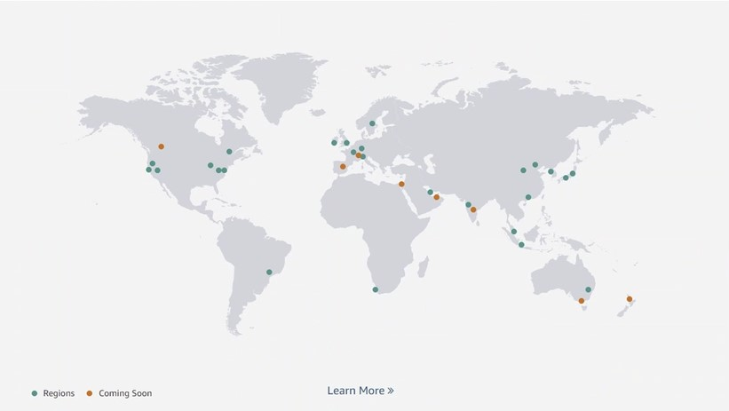
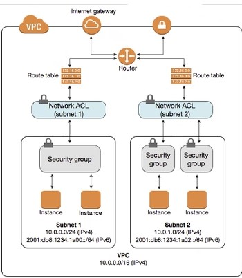
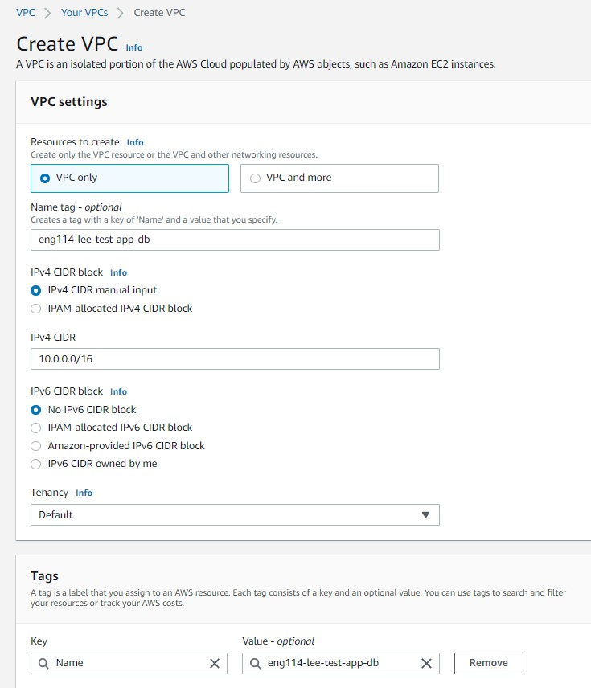
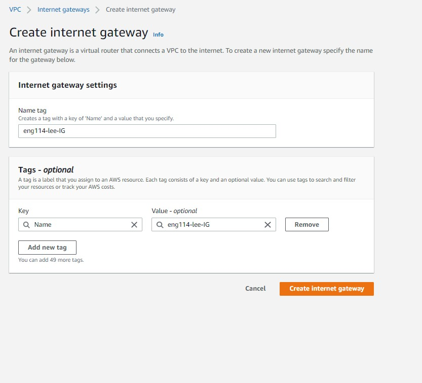
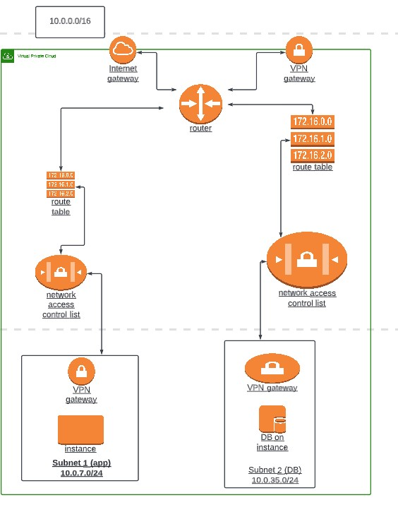

# AWS History

In 2012 cloud computing was a shared resource, meaning no data security against others sharing that cloud space.
now in 2020 resources are no longer openly shared, and only the key holder can access the data and thoses the key holders permit.

## AWS VPC Architecture

NACL works on a subnet level

## Step 1: Create a VPC in Ireland eu-west-1
---

## Step 2: Create Internet Gateway
---

### 2.1 attach the internet gateway with your VPC
---

### Step 3: Create a subnet/s - Associte subnet with your subnet with your VPC

- Step 4: Create a route table 
- 4.1 Edit route table to add rules to connect to IG

cidr Block - 10.0.0.0/16
want to use - 10.0.1.0/24

## Planning App and DB VPC

Lee cidr block - 10.0.7.0/25

