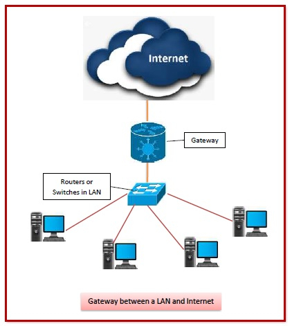
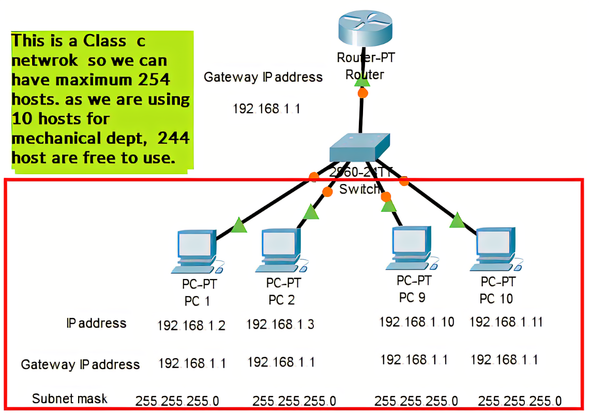
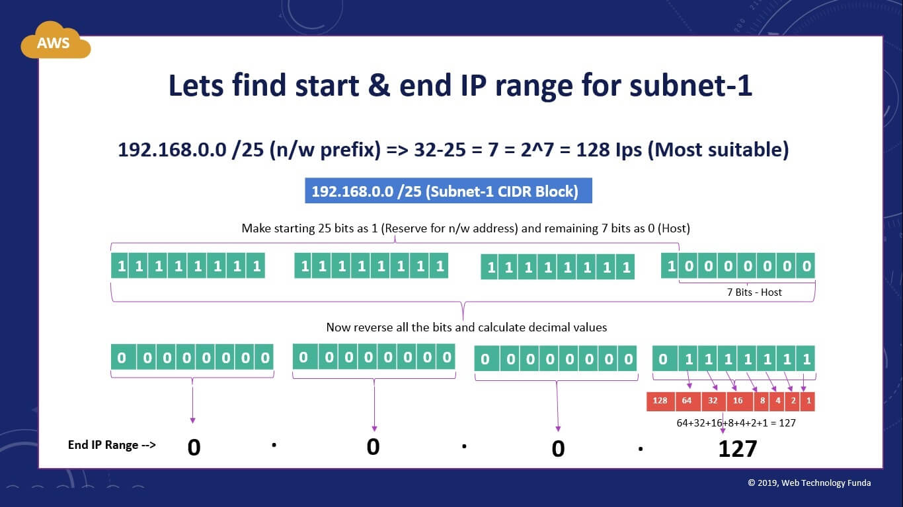
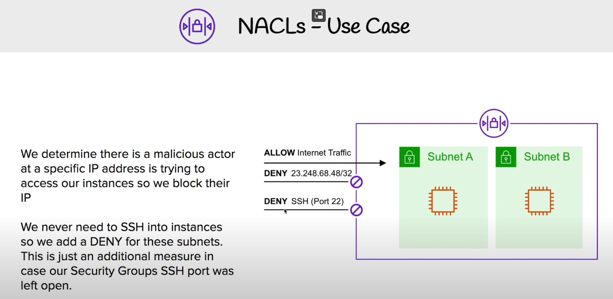

# AWS VPC

## What is a VPC - why should we use it - benefits
---
.jpg)

### VPC - Virtual Private Cloud
---
### Why should we use it
 ---
 It's an on-demand configurable pool of shared resources allocated within a public cloud environment, providing a certain level of isolation between the different organizations

### Benefits
---
Better Security. The biggest benefit of a VPC is the optimal security it offers.

Scalable for Your Business. Ideally, you want your business to grow, right? Another VPC advantage is its flexibility and scalability.

Updates Seamlessly. All software, whether it’s on-premise or virtual, must undergo regular updates. For many businesses, these updates can result in downtime and a waste of valuable work time.

Easy to Integrate With Hybrid Options. Integrating a new infrastructure can be a stressful situation. 

Disaster Redundancy. Easy integration will also help you form a fool-proof disaster recovery plan. 

Eco-Friendly. More businesses and individuals today are looking to go green. Not only does going green save your business money it may also grant you tax breaks.

## What is an internet gateway
---

A gateway is a network node that forms a passage between two networks operating with different transmission protocols. The most common type of gateways, the network gateway operates at layer 3, i.e. network layer of the OSI (open systems interconnection) model. However, depending upon the functionality, a gateway can operate at any of the seven layers of OSI model. It acts as the entry – exit point for a network since all traffic that flows across the networks should pass through the gateway. Only the internal traffic between the nodes of a LAN does not pass through the gateway.

## What is a Subnet
---

A subnet, or subnetwork, is a network inside a network. Subnets make networks more efficient. Through subnetting, network traffic can travel a shorter distance without passing through unnecessary routers to reach its destination.

## What is a CDIR block - how to create one
---

### What is a CDIR block
---
CIDR is mainly used to use IP addresses and solve the routing table explosion efficiently. It is defined in RFC (Request for comments) 1518 and RFC 4632. It is an address block allocation. There are five different classes in the IPV4 addressing system. The IP address classes are used for Internet IP addresses assignment.

### How to create one
---
First you define the block, e.g. you need to choose the actual range and size.

Typical in an AWS VPC you would opt for one of the internal private network LAN ranges:

10.0.0.0 – 10.255.255.255
172.16.0.0 – 172.31.255.255
192.168.0.0 – 192.168.255.255

Typical when you would need to become part of a larger(e.g.on premise) network, you would check availability if one of the ranges is still free, e.g. in a IPAM database, or check with the cloud competence center, network center, etc. If the solution is fully independent and can interface via other ranges or devices (like public internet, physical storage) the choice is random and free.

To know the CiDR size you need to understand how many interfaces (IPs) and subnets you would need, for example a medium web environment would typical use 6 subnets (3 in two zones) e.g. dmz, app and db and offer 250 or so free IPs in each subnet. So in total you would need about 6 x 255 IPs = 1530.

In such a case your VPC CIDR could be:

10.0.0.0/21

This will allow for 6 subnets, and offers 2048 IPs.

In general, especial when you don’t need to consider existing IP ranges, its not that harmfull to use a larger size, just to cater for unforseen requirements, causing the need for more ips. Note there are many ways to extend as well, e.g. add additional CIDRs, to the VPC, or split the network into multiple VPCs and using a routing solution like AWS Transit Gateway.

## What is an NACLs - use case of NACL

NACL refers to Network Access Control List, which helps provide a layer of security to the Amazon Web Services stack.  

NACL helps in providing a firewall thereby helping secure the VPCs and subnets. It helps provide a security layer which controls and efficiently manages the traffic that moves around in the subnets. It is an optional layer for VPC, which adds another security layer to the Amazon service. 

VPC refers to Virtual private Cloud, which can be visualized as a container that stores subnets. Subnets can be considered as a container, which helps store data.