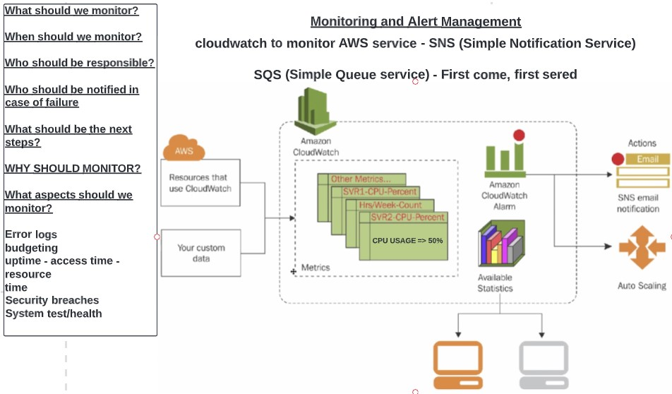
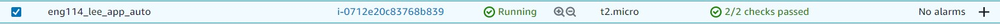
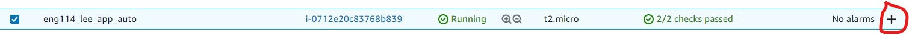
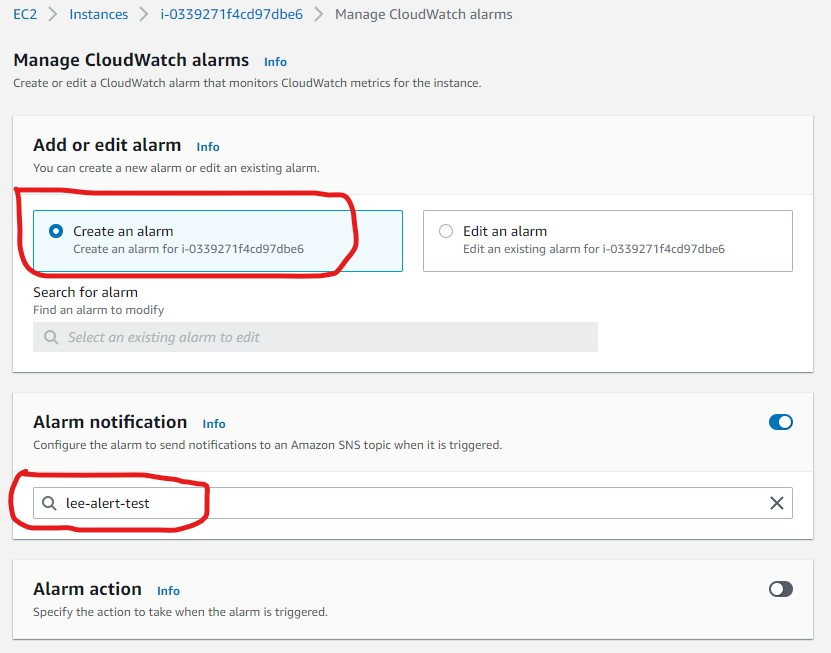
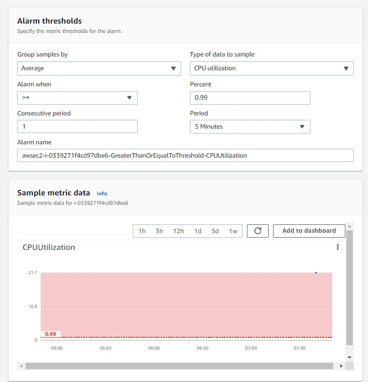
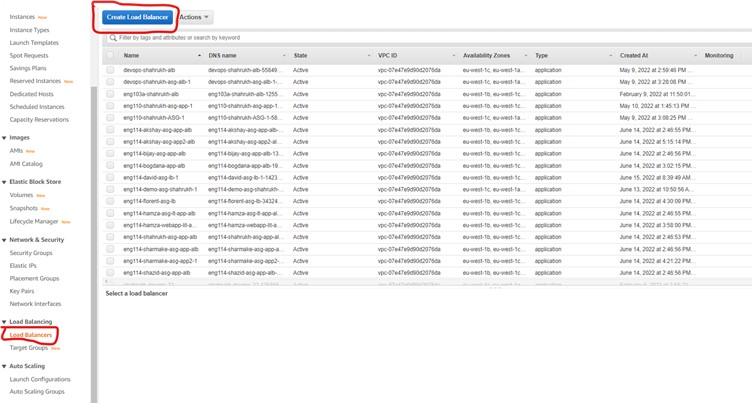

# Monitoring and Alert Management

## Types of Monitoring 

- Cloudwatch to monitor AWS service - SNS (Simple Notification Service)

- SQS (Simple Queue service)
First come, first serve bases

## Steps to set up an alert to monitor and send notifcation

### Setting up alert
1. With your instances running as shown

2. Press the + button next to "no alarm" as shown below

3. Then either create or edit an alarm as shown below

4. Scroll down the page to find parameters for alarm
Change parameter as needed

Press CREATE
---

### Create load balancer
In the list on the left side of screen, press Load Balancer.
Then press CREATE LOAD BALANCER
