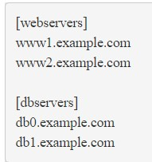
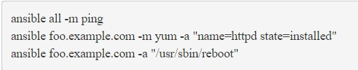
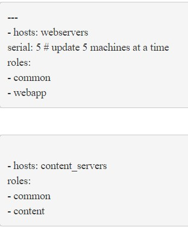

# Ansible

## What is Ansible?
Ansible is a radically simple IT automation engine that automates cloud provisioning, configuration management, application deployment, intra-service orchestration, and many other IT needs.

On this page, we'll give you a really quick overview so you can see things in context. For more detail, hop over to docs.ansible.com.

## Why should we use it?
Designed for multi-tier deployments since day one, Ansible models your IT infrastructure by describing how all of your systems inter-relate, rather than just managing one system at a time.

It uses no agents and no additional custom security infrastructure, so it's easy to deploy - and most importantly, it uses a very simple language (YAML, in the form of Ansible Playbooks) that allow you to describe your automation jobs in a way that approaches plain English.

## Benefits

- EFFICIENT ARCHITECTURE

Ansible works by connecting to your nodes and pushing out small programs, called "Ansible modules" to them. These programs are written to be resource models of the desired state of the system. Ansible then executes these modules (over SSH by default), and removes them when finished.

Your library of modules can reside on any machine, and there are no servers, daemons, or databases required. Typically you'll work with your favorite terminal program, a text editor, and probably a version control system to keep track of changes to your content.

- SSH KEYS ARE YOUR FRIENDS

Passwords are supported, but SSH keys with ssh-agent are one of the best ways to use Ansible. Though if you want to use Kerberos, that's good too. Lots of options! Root logins are not required, you can login as any user, and then su or sudo to any user.

Ansible's "authorized_key" module is a great way to use ansible to control what machines can access what hosts. Other options, like kerberos or identity management systems, can also be used.

`ssh-agent bash`
`ssh-add ~/.ssh/id_rsa`

- MANAGE YOUR INVENTORY IN SIMPLE TEXT FILES

By default, Ansible represents what machines it manages using a very simple INI file that puts all of your managed machines in groups of your own choosing.  

To add new machines, there is no additional SSL signing server involved, so there's never any hassle deciding why a particular machine didn’t get linked up due to obscure NTP or DNS issues.

If there's another source of truth in your infrastructure, Ansible can also plugin to that, such as drawing inventory, group, and variable information from sources like EC2, Rackspace, OpenStack, and more.

Here's what a plain text inventory file looks like:

Once inventory hosts are listed, variables can be assigned to them in simple text files (in a subdirectory called 'group_vars/' or 'host_vars/') or directly in the inventory file.

Or, as already mentioned, use a dynamic inventory to pull your inventory from data sources like EC2, Rackspace, or OpenStack.

- THE BASICS: USING ANSIBLE FOR AD HOC PARALLEL TASK EXECUTION
Once you have an instance available, you can talk to it right away, without any additional setup:

Note that we have access to state-based resource modules as well as running raw commands. These modules are extremely easy to write and Ansible ships with a fleet of them so most of your work is already done.  

Ansible contains a giant toolbox of built-in modules, well over 750 of them.

- PLAYBOOKS: A SIMPLE+POWERFUL AUTOMATION LANGUAGE

Playbooks can finely orchestrate multiple slices of your infrastructure topology, with very detailed control over how many machines to tackle at a time.  This is where Ansible starts to get most interesting.

https://youtu.be/VRoQLVHdNHE

Ansible's approach to orchestration is one of finely-tuned simplicity, as we believe your automation code should make perfect sense to you years down the road and there should be very little to remember about special syntax or features.

Here's what a playbook looks like.  As a reminder, this is only here as a teaser - hop over to docs.ansible.com for the complete documentation and all that's possible.

