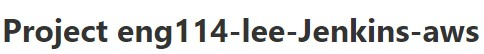
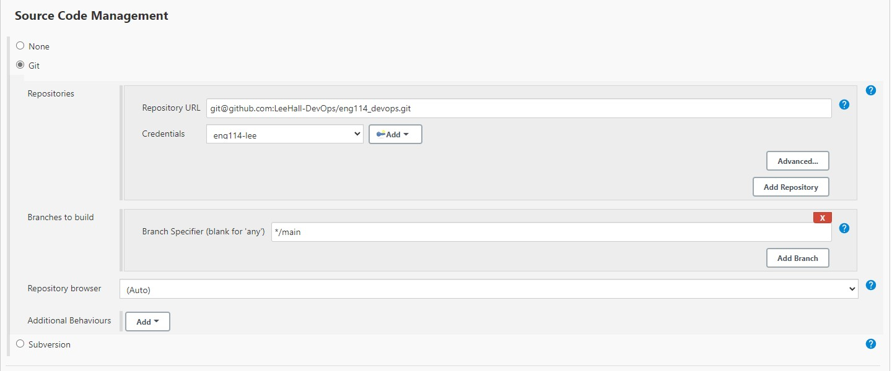

# Connecting Jenkins to AWS EC2

## Create a new Item/build (eng114-lee-Jenkins-aws)
- Give new Item an identifiable name like image below:

- Enter a description to explain the items purpose.

- Office 365 Connector, tick `Restrict where this project can be run

- Source code management, enter URL from GitHub, pick Credentals, enter github branch.

- Build Triggers, tick `Build after other projects are built`, enter CI Item, tick `Trigger only if buid is stable`

- Build Environment, tick `SSH Agent`, add `Credentials`

- Build, Enter commands in shell execute to be executed in AWS EC2

- Press `Apply` then `Save`

## In previous folder (lee-CI)

- Add name of new Item/build (eng114-lee-Jenkins-aws), tick `Trigger only if build is stable`

### Ensure to check all file paths properly and IP addresses match before pushing to github
still
hoping