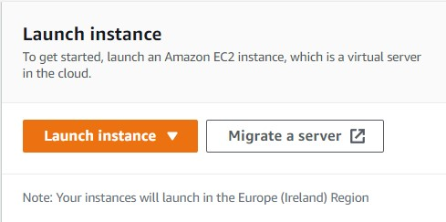
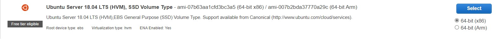
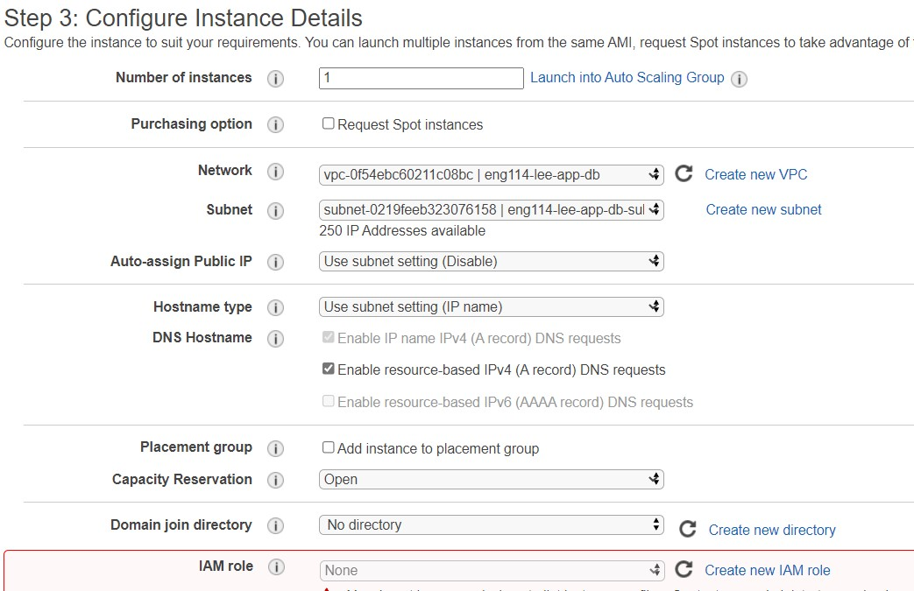
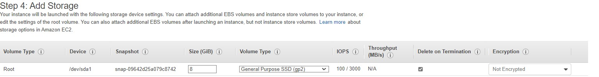
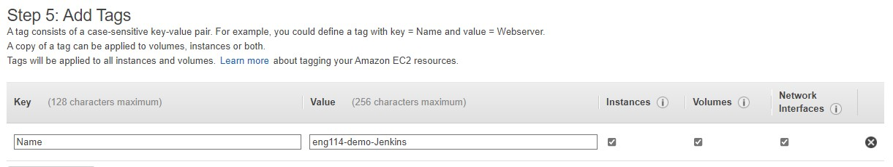
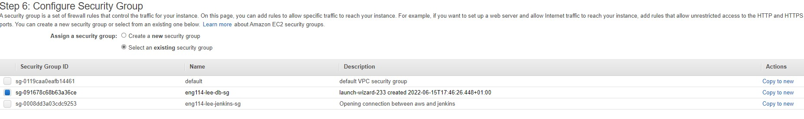
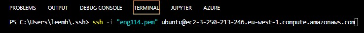

# Connecting AWS EC2 to Jenkins

## Step 1 Create a new EC2 instance

- Launch a new instance

- Pick a machine type `Ubuntu Server 18.04 LTS (HVM), SSD Volume Type`

- Pick a machine type `t2 micro`

- Configure Instance details as needed

- Pick storage needs required

- Add a tag/name for instance

- Select or create a security Group

- Review Then Launch

## SSH into new Instance 

