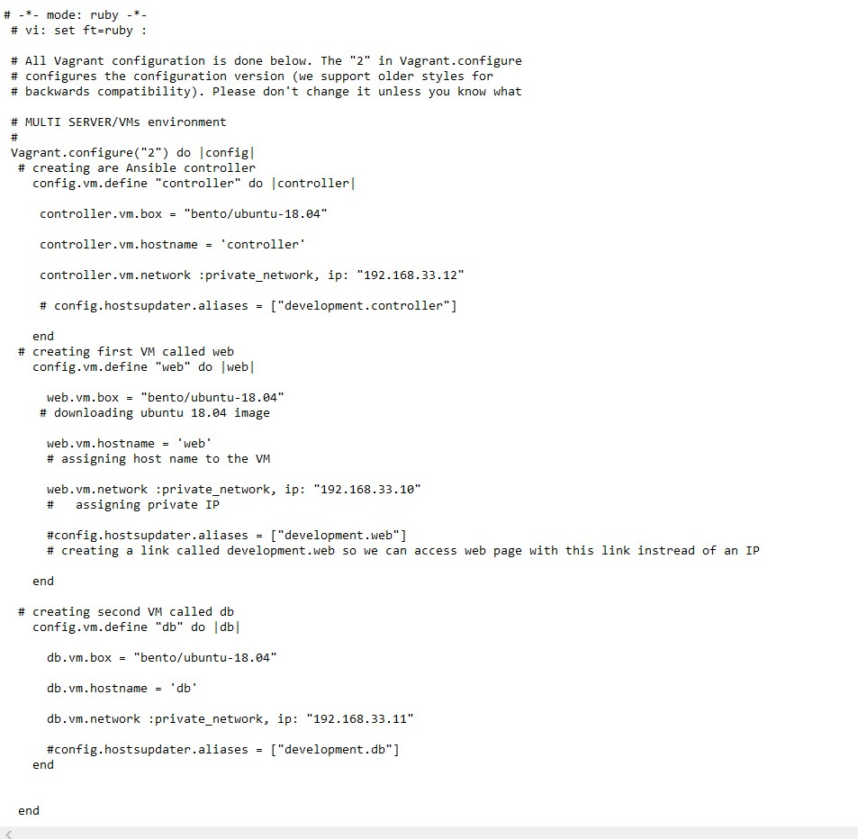
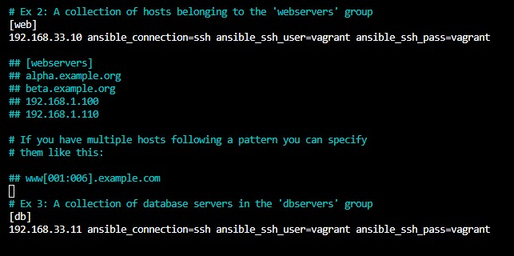

# Building Ansible Controller

## In a Terminal, 

- Enter `Vagrant up`

- navigate to the "Vagrantfile" in GUI

## Inside vagrantfile, enter the following code:

## Back in Terminal enter `vagrant up`

- ssh into each machine: controller, web or db,  one at a time and enter `sudo apt-get update -y && sudo apt-get upgrade -y` then exit machine.

- ssh into `controller` machine, then enter commands below

- `sudo apt-get update -y`

- `sudo apt-get install software-properties-common`

- `sudo apt-add-repository ppa:ansible/ansible`

- `sudo apt-get install ansible -y`

`sudo nano /etc/ansible/hosts`

## Inside "hosts" file enter the following

 

- Once finished, save then exit

- test controller connections by entering command below
`vagrant@controller:/etc/ansible$ ansible web -m ping`

## Ansible ad-hoc commands

- Tell you the details of choosen machine
ansible [name of machine] -a "uname -a"

- Finding time zone of server
ansible [name of machine] -a "date"

- Server hardware
ansible [name of machine] -a "free"

- Folder structure of server
ansible [name of machine] -a "ls" or "ls -a"

- TASK
Find ad-hoc command to send file

- install tree
`sudo apt-get install tree -y`, then type `tree` to see the dir in branch view

## Create a playbook yml file by entering 
`sudo nano nginx-playbook.yml` in the /ect/ansible directory

- Enter the following code:

- run yml program
Type `ansible-playbook nginx-playbook.yml`

