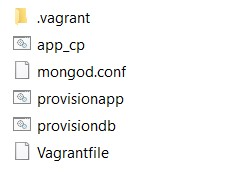
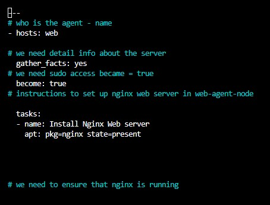

# Building Ansible Controller

## Ansible - Step by Step

### 1.	Vagrant up (This will start local machines)
---
`Vagrant up`

### 2. Insert machines configuration into VAGRANTFILE
---

### 3. SSH into VAGRANT controller
---
`vagrant ssh controller`

### 4. once inside controller machine	
---
`Sudo apt-get update -y && sudo apt-get upgrade -y`

### 5. Install python dependancies
---
`Sudo apt-get install software-properties-common -y`

### 6. Install Ansible from open source 
---
`Sudo apt-add-repository ppa:ansible/ansible`

### 7. Go to host directory	
---
`Sudo nano /etc/ansible/hosts`

### 8. Enter [web], web machine IP followed by
---
[web]
`192.168.33.10 ansible_connection=ssh ansible_ssh_user=vagrant ansible_ssh_pass=vagrant`

### 9. Do the same for the DB machine
---
[db]
`192.168.33.11 ansible_connection=ssh ansible_ssh_user=vagrant ansible_ssh_pass=vagrant`

### 11. Ensure the controller is linked to both machines using:
---
`vagrant@controller: /etc/ansible$ ansible all -m ping`

### 12. To enter the web machine:
--- 
- `ssh vagrant@192.168.33.10` for WEB machine
or
- `ssh vagrant@192.168.33.11` for DB machine

### 13. Create a playbook.yml:
---
-`Sudo nano name-playbook.yml`

### 14(a). choose a host – web or DB
---
- `Hosts: web`
	

### 14(b). Do I need details about the server?  Yes or no
---
- `Gather_facts: yes`

### 14(c). Do I need sudo access? True or false
---
- `Become: true`

### 14(d). What tasks do I want the playbook to do? Install/add
---
- `Tasks:`
- `Name: Install Nginx Web Server`
- `Apt: pkg=nginx state=present`

### 15. Run playbook using Ansible:
---
- `ansible-playbook Nginx-playbook.yml`

### 16.	Check web machine IP in the browser
---
test controller connections by entering command below

- `vagrant@controller:/etc/ansible$ ansible web -m ping`

### 17. From controller machine ssh into another machine:
- "For WEB" - `ssh vagrant@192.168.33.10`

- "For DB" - `ssh vagrant@192.168.33.11`

- "For EXAMPLE" `ssh vagrant@exa.mp.le.IP`

## Ansible ad-hoc commands

- Tell you the details of choosen machine
ansible [name of machine] -a "uname -a"

- Finding time zone of server
ansible [name of machine] -a "date"

- Server hardware
ansible [name of machine] -a "free"

- Folder structure of server
ansible [name of machine] -a "ls" or "ls -a"

- TASK
Find ad-hoc command to send file

- Enter the following code:

- run yml program
Type `ansible-playbook nginx-playbook.yml`

### debugging command
In web machine

- sudo npm start
- sudo npm i 
- sudo rm -rf node_modules/
- sudo npm install -g npm@lastest
- sudo n stable
- sudo npm install -g n
- ps aux
- sudo npm clean -f
- npm cache clean -g n

- install tree
`sudo apt-get install tree -y`, then type `tree` to see the dir in branch view