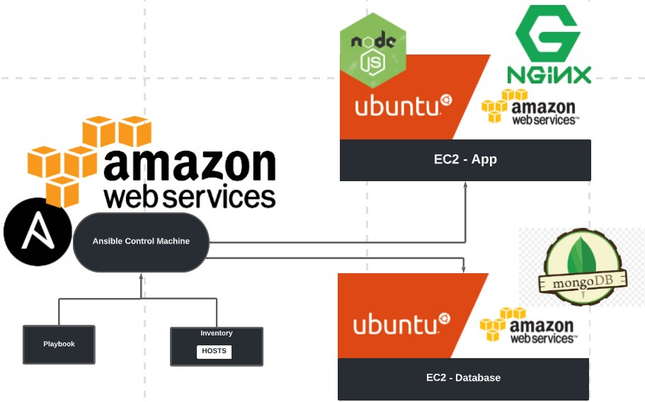

# Presentation prep

## Create a diagram

## Step by step

- Stop app instances for failure in demo

### Start of presentation
- Explain diagram - briefly
- Show controller and app instances working and where (Ireland)

- Show and explain tests

### see fail_test.yml for details

4. testing connection from controller to app
- `sudo ansible -m ping all`
Should receive "pong" response

Ensure `sudo apt-get install tree -y`
5. Show list of playbooks

6. run test.yml playbook
-`sudo ansible-playbook test.yml`