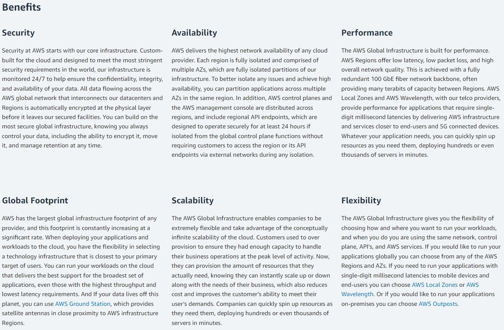
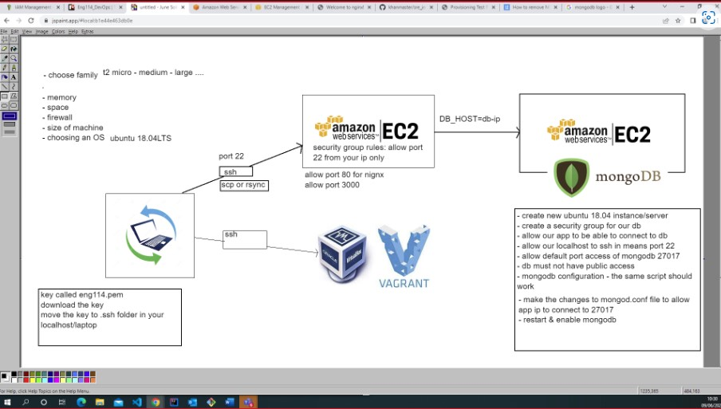

## Most used commands
___
- Update ubuntu: `sudo apt-get update -y` 
- upgrade ubuntu: `sudo apt-get upgrade -y`
- Install nginx: `sudo apt-get install nginx -y`
- Check nginx status: `systemct1 status nginx` or `stop` or `start` or `restart` 
- Who am I `iname` or `uname -a`
- where am I `pwd`
- How to create a folder in linux `mkdir dir_name`
- How to check dir/file `ls` or `ls -a`
- change dir `cd name-dir`
- come out/back of/from the current location `cd ..`
- how to create a file `touch filename` or `nano file-name` 
- move test.txt from current location to devops folder
- Cut paste `mv test.txt devops` copy `cp path_of_data path_of_destination`

## File permissions
- READ `r` WRITE `w`  `x`
- How to check file permission `ll`
- Change permissions `chmod permission file-name`

### Bash Scripting
- create a file called `provision.sh`
- change permission of this file `chmod +x provision.sh`

- first line `MUST BE` starting with `#!/bin/bash`
- update & update
- installed nginx
- start nginx
-`enable nginx
- checked status
- stopped then started 

## adding external script to vagrant
config.vm.provision "file", source: "./provision.sh", destination: "$HOME/" 

## steps for passing app spec test

- curl -sL https://deb.nodesource.com/setup_6.x | sudo -E bash -
- sudo apt-get install nodejs -y
- sudo npm install pm2 -g
- sudo apt-get install python-software-properties

## Creating development environment step by step

### Setting up vagrant environment 
#### (The env we can work on with effecting the localhost)
---
#### open Git Bash (Ensure you are admin when running commands in command line)
1. Type `vagrant init "ubuntu/xenial64"` in command line, press enter. (This will initialize the folders for vagrant)

2. Type `vagrant up` 
press Enter. (This starts the vm)

3. Type `vagrant ssh`
press Enter. (This transfers you into vm)

#### once inside vm
4. Type `sudo apt-get update -y` 
(This gets updates for VM, the (-y) says yes to any questions automatically)

5. Type `sudo apt-get upgrade -y`
(This updates the VM's features)

6. Type `sudo apt-get install nginx -y` 
(This installs software needed)

7. Type `sudo systemctl enable nginx -y` 
(This enables nginxs to work without requesting permission)

8. Type `sudo systemctl status ngnix -y` 
(This checks the vm network is working)

9. Type `curl -sL http://deb.nodesource.com/setup_6.x | sudo -E bash -y` (Download) 

## Reverse Proxy
sudo nano /etc/nginx/sites-available/default

### Change default file
    location / {
        proxy_pass http://localhost:3000;
        proxy_http_version 1.1;
        proxy_set_header Upgrade $http_upgrade;
        proxy_set_header Connection 'upgrade';
        proxy_set_header Host $host;
        proxy_cache_bypass $http_upgrade;
    }

`sudo nginx -t` to make sure that there are no syntax errors

`sudo systemctl restart nginx` to restart nginx and set up the reverse proxy

You always have to change the port number after the colon to match your needs

location allows you to provide access to other applications on the same server. For example, if location /some/path/, the url would be http://www.example.com/some/path/index.html

proxy_pass passes the url through to a HTTP server

## What is Cloud computing with AWS?

### AWS Global
information about AWS con be found at: [AWS-Global infrastructure linked here](https://aws.amazon.com/about-aws/global-infrastructure/) 

role of region
make sure to deploy in the right location for client

azs = multi availiblity zones
we need at least two availibility zones, reason being if zone_one goes off line. the data is diverted to zone_two. until zone_one is fixed

### buzz word
- highly available 
- scaliable

## What are the benefits?

## How does it fit into DevOps?
Information resource [aws.amazon.com/devops/](https://aws.amazon.com/devops/)

- Get started Fast
Providing you have an Aws account, you can use any AWS service without any setup or installation.

- Fully managed services
AWS manages all the software and hardware, this leaves the dev to focus on the project

- Built for scalabilitie
Aws services are built to scale up or down as needed with no time delay in the service.

- Programmable
AWS gives the account holder the option to use the services command lind, API or SDKs to model and provision AWS resources.

- Automation
AWS assists in automation so you can build quicker and more effiently. with AWS you can automate manual tasks or processes like.
1. Deployment
2. Test work flow
3. Container management
4. configuration management

- Secure
AWS has data security in place called Identity and Access Management or (IAM), IAM sets the user permission which gives the account holder control over who can access it. 

## Data centre video and notes

[Inside a Google data center](https://www.youtube.com/watch?v=XZmGGAbHqa0)

- A giant building with lots of machines
- south carolina one node
- Operational and online twenty-four hours a day, seven days a week 
- Record of 3,000,000 man hours without default at time of recording 

### Security info 

1. ID badges checked at gate
2.  once in building personal go through rotating security corridor, then ID and retina checked. 
3. room temp 80f
4. custom server rack
5. cooling tech changed 5 times since data centre opened.
6. cooling coils above server racks collect heat then transfer to towers on the roof to cool. then recirculated/
7. old harddrives cleared and crushed then recycled

innovation always moving

## Capital expense
- Rent building
- Buying hardware
- Uiring security guards
- Utilitie bills

example xmas
xmas service is peek time as oppose to janurary

cloud server peek time is always

### AWS EC2

#### Common commands for AWS EC2
scp or rsync

#### Planning
- choose family - t2 micro / medium / large ..

- hard drive
- memory
- space
- fire wall
- size of machine
- choosing an OS - ubuntu 18.04LTS

##### process 
1. Search ec2,
2. Create instance
3. select machine - ubuntu 18.04 LTS server
4. Select tags eng114_...
5. Select security rules 
- ec2 allows port 22 by default
- nginx port 80
- app port 3000

##### copy files from localhost to EC2
`scp -i [key_file] -r [path to folder/file you want copied] [path to location you want file to go to]:~`

###### AWS Network Diagram

###### Two tier network

##### What are Amazon machine images (AMI)
Takes a snap shot of the machine and it's data at that time

### Commands for aws s3

 - To copy a file from ec2 to aws s3
 `aws s3 cp text.txt s3://my-bucket`
