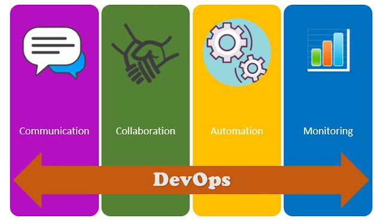

# What is DevOps
DevOps is the merging of the development team and the operations team, this merging prevents each team from blaming the the other. 
DevOps come is of a open culture that promotes resposibilie, trust and respect. DevOps increase the productivity in the workplace by automating continuous development and intergration.

## Why DevOps - Benefits
- Reduced production time - weeks or months became days
- Flexibility - teams are able to keep up with stake holder changes.
- reduce cost - due to reuseable code employee are only paid to write the code once. 

## Role of DevOps
devOps consultant is to be able to work along side both developers and the operator. 

## What is Development env and why do we need it?
The DevOps environment is a virtual layer or machine that allows us to create a development environment with vagrant as the machine layer.

## What are the four pillars of DevOps?

- Communication
Teams need to communicate constantly to ensure each member of the team is on the same page of what tasks have been done and which tasks have not.

- Collaboration
Collaboration is key for a true DevOps approach. Better collaboration between the dev and ops teams help them achieve a streamlined process which helps the team in
1. Better understanding of the target infrastructure and be well prepared with the changes in the product required for the changes in the infrastructure
2. Prepare the target infrastructure with the changes needed for the upcoming releases of the software to avoid delays in the releases due to challenges in the environments.

Successful DevOps teams work effectively with collaboration platforms like Yammer, SharePoint etc. to facilitate this process.

- Automation
Automation is the heart of every successful DevOps transformation process and the single biggest enabler for DevOps. The success of DevOps lies in stable environments, consistent build and test process and happy releases. Automation can be used to make the release process more deterministic and to bridge the gap between development and production. Development teams can learn from operations the value of automation and how to create automation scripts to improve the overall process. Together the team is responsible for defining the desired state of the infrastructure and convert this to code.

Tools like PowerShell DSC, Chef, Puppet etc. can  be used to automate almost anything and everything that the team needs. During the process, the operations learn about version control, testing, CI builds etc. when working together with the development teams.

- Monitoring
Monitoring in DevOps teams are required to provide crucial information that ensure service uptime and optimal performance. It's important to measure the progress of the approach to know whether teams are improving or making progress. With the support of proper data and metrics, it’s easy for teams to inspect the current way of working and come up with ideas or processes to improve the overall CD/ DevOps movement. Measuring the current capabilities and process helps teams determine the problem areas and defined focus points for making a change.

An important DevOps practice is to work with application monitoring and insights to enable full end-to-end traceability in a product to provide both operational insights and  usage understanding. Tools and technologies like ELK stack, Application insights etc. can be used for effective monitoring.

## Most used commands
___
- Update ubuntu: `sudo apt-get update -y` 
- upgrade ubuntu: `sudo apt-get upgrade -y`
- Install nginx: `sudo apt-get install nginx -y`
- Check nginx status: `systemct1 status nginx` or `stop` or `start` or `restart` 
- Who am I `iname` or `uname -a`
- where am I `pwd`
- How to create a folder in linux `mkdir dir_name`
- How to check dir/file `ls` or `ls -a`
- change dir `cd name-dir`
- come out/back of/from the current location `cd ..`
- how to create a file `touch filename` or `nano file-name` 
- move test.txt from current location to devops folder
- Cut paste `mv test.txt devops` copy `cp path_of_data path_of_destination`

## File permissions
- READ `r` WRITE `w`  `x`
- How to check file permission `ll`
- Change permissions `chmod permission file-name`

### Bash Scripting
- create a file called `provision.sh`
- change permission of this file `chmod +x provision.sh`

- first line `MUST BE` starting with `#!/bin/bash`
- update & update
- installed nginx
- start nginx
-`enable nginx
- checked status
- stopped then started 

## adding external script to vagrant
config.vm.provision "file", source: "./provision.sh", destination: "$HOME/" 

## steps for passing app spec test

- curl -sL https://deb.nodesource.com/setup_6.x | sudo -E bash -
- sudo apt-get install nodejs -y
- sudo npm install pm2 -g
- sudo apt-get install python-software-properties